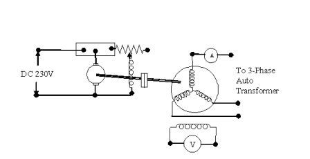
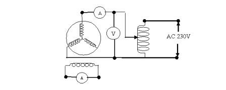

## Equipments Required in Experiment - 2

## Procedural Steps

1. Connect circuit as shown in Fig. (connection diagram). Set output to zero.  
2. Start DC motor and run slightly below synchronous speed.  
3. Switch on AC supply and increase variac output. Observe readings.  
4. Fine-tune motor speed to get maximum swings in meters.  
5. Note maximum and minimum voltage/current readings.  
6. Take multiple readings at different variac settings.  
7. Increase speed slightly above synchronous speed and repeat readings.

# Connection Diagrams of Experiment - 2

  

**Fig 2.1 Connection Diagram for Slip Test**

  

**Fig 2.2 Connection Diagram for Static Test**

## Observation Table

| S.No. | Voltage (Max–Min) | Current (Max–Min) | Xd | Xq | Speed |
|------|-------------------|-------------------|----|----|--------|
| 1    | .                 | .                 | .  | .  | .      |
| 2    | .                 | .                 | .  | .  | .      |
| 3    | .                 | .                 | .  | .  | .      |
| ...  | .                 | .                 | .  | .  | .      |
| n    | .                 | .                 | .  | .  | .      |

---

### Average Values

**Average value of Xd = ________**  
**Average value of Xq = ________**
