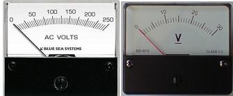
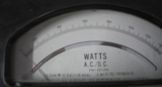

# Equipments Required in Experiment - 2

 

|  |  |
|-------------------------------------------------------------------|---------------------------------------------|
| **Fig.1: DC Motor - Synchronous Generator set**                   | **Fig.2: Ammeter: 0 - 20A; 0 - 3 A**         |

|  |  |
|-------------------------------------------------|---------------------------------------------|
| **Fig.3: Voltmeter: 0 – 30V; 0 – 250V**          | **Fig.4: Wattmeter: 0 - 1400 W**            |

 

# Connection Diagrams of Experiment - 2

  

  

  <b>Fig 2.1 Connection Diagram for Slip Test</b>

  

  

  <b>Fig 2.2 Connection Diagram for Static Test</b>

